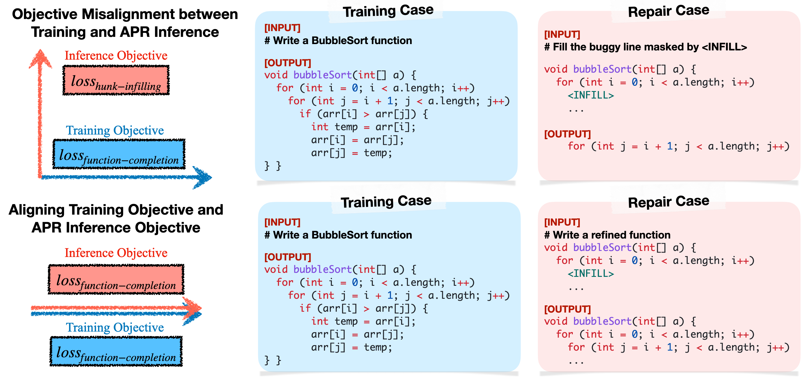
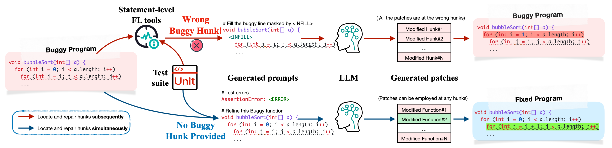
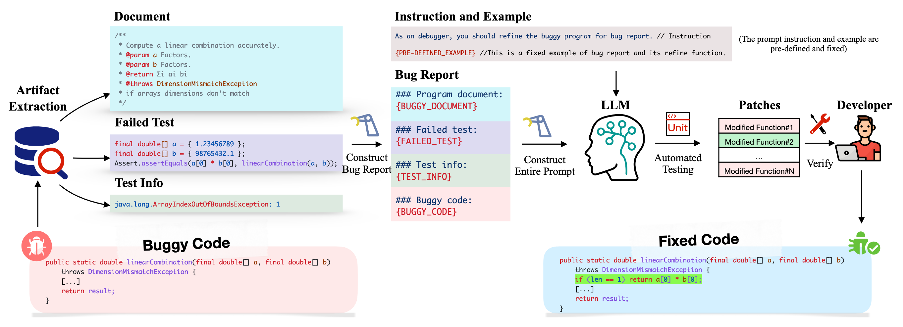

# Aligning the Objective of LLM-based Program Repair

 [](LICENSE) [](https://arxiv.org/abs/2404.08877)

> This repository provides artifacts of D4C. However, the *D4C method* is not the focus of the paper. Instead, the paper aims to explore how to *model* APR task in the era of autoregressive large language models. We hope the *insights* on D4C will inspire more effective APR methods in the future. 
> See our [talk on BiliBili](https://www.bilibili.com/video/BV19aBjYzECg/?share_source=copy_web&vd_source=458ae8ad245dcde451e270ec77861f13&t=5389) (in Chinese).

## Overview

Large language models (LLMs) have achieved decent results on automated program repair (APR). However, the next token prediction training objective of decoder-only LLMs (e.g., GPT-4) is misaligned with the masked span prediction objective of current infilling-style methods, which impedes LLMs from fully leveraging pre-trained knowledge for program repair.



In addition, while some LLMs can locate and repair bugs in certain functions using the related artifacts (e.g., test cases), existing methods still depend on statement-level fault localization methods to provide a list of buggy hunks for repair. This restriction hinders LLMs from exploring potential patches beyond the given locations.



In this paper, we investigate a new approach to adapt LLMs to program repair. Our core insight is that LLM's APR capability can be greatly improved by simply aligning the output to their training objective and allowing them to refine the whole program without first identifying faulty statements. Based on this insight, we designed D4C, a straightforward prompting framework for APR. D4C can repair 180 bugs correctly in Defects4J, with each patch being sampled only 10 times. This surpasses the SOTA APR methods with perfect fault localization by 10% and reduces the patch sampling number by 90%. 



Our findings reveal that (1) objective alignment is crucial for fully exploiting LLM's pre-trained capability, and (2) replacing the traditional localize-buggy-hunks-then-repair workflow with direct debugging is more effective for LLM-based APR methods. Thus, we believe this paper introduces a new mindset for harnessing LLMs in APR. 

## How to run?

### Environment Setup

Recommend using Linux platform with GPUs capable of performing local inference for the Mixtral 8x7b MoE model.

- Python 3.10

To install Python dependencies, run:

```bash
pip install -r requirements.txt
```

##### Setup Defects4J:

> ⚠️ Defects4J was updated to v3.0 in 2024.09, which added (e.g., Collections) or removed (e.g., Lang) bug cases from v2.0. Therefore, we have to skip the patch validation for the deprecated bug cases in D4C's original results. See [here](#patch-validation).

1. Clone Defects4J from [GitHub](https://github.com/rjust/defects4j).

2. Install dependencies:

    - Java 11

    - Git >= 1.9

    - Subversion (svn) >= 1.8

    - Perl >= 5.0.12

3. Setup Defects4J following its README ("path2defects4j" points to the defects4j directory.) :

   ```bash
   cd defects4j
   cpanm --installdeps .
   ./init.sh
   export PATH=$PATH:"path2defects4j"/framework/bin
   ```

   To verify that your Defects4J environment and Java/Perl dependencies are correctly set up, please run the following commands:

   ```bash
   defects4j checkout -p Chart -v 1f -w defects4j/Chart_1_fixed
   cd Chart_1_fixed
   defects4j test
   ```

   If the checkout is successful and all tests pass, the Defects4J environment is configured correctly.

4. Run `python checkout.py` to checkout the buggy repositories in the D4C directory. 

##### Setup DebugBench:

> ⚠️ DebugBench requires LeetCode account cookies for automated evaluations. To avoid a single account being banned due to frequent submissions, we recommend creating multiple LeetCode accounts (at least 3).

1. Create a LeetCode account and login from [LeetCode](https://leetcode.com/).

2. Get the cookie. The method to get cookies varies by browser. For example, in Chrome, you may need to use extensions like [EditThisCookie](https://chromewebstore.google.com/detail/editthiscookie/fngmhnnpilhplaeedifhccceomclgfbg?pli=1). Below, we use FireFox as an example:

   - `Ctrl + Shift + I` (Windows/Linux) or `Cmd + Option + I` (Mac) to open web developer tools

   - Swith to `Network` on web developer tools

   - `F5` to refresh LeetCode webpage

   - Search for requests with keywords `graphql` on web developer tools

   - Choose any request and switch to `Cookie` field

   - Find the `LEETCODE_SESSION` and `csrftoken` in `Cookie` field

3. Copy and paste the cookie in the `config.yaml` in D4C directory

##### Setup remote model:

1. Create an OpenAI account and obtain your API Key from [OpenAI](https://platform.openai.com/api-keys). The API Key looks like `sk-xxxxx`

2. Copy and paste the key to the `api_key` field in `config.yaml`

3. The default remote model is `gpt-4-0613`. If you want to use other model, please modify `remote_model` field in `config.yaml`

##### Setup local model:

1. Download the open-sourced model checkpoint from [HuggingFace](https://huggingface.co/mistralai/Mixtral-8x7B-Instruct-v0.1)

2. If your huggingface model is saved in the default directory, leave the `cp_path` field in `config.yaml`as default. Otherwise, set it to the model path

3. The default remote model is `mistralai/Mixtral-8x7B-Instruct-v0.1`. If you want to use other model, please modify `local_model` field in `config.yaml`

### Patch Generation

To run the main experiment in perfect FL setting, just run:

```bash
bash batch.sh
```

Note that:

1. The script only executes the main experiment (GPT-4-based D4C on Defects4J, Mixtral-based D4C on Defects4J, GPT-4-based D4C on DebugBench). To run the insight validation or ablation study, you need to uncomment the corresponding sections in the script.

2. The script generates `$max_try` patches for each bug, which can be expensive for Defects4J experiments due to the length of the code snippets in this dataset. To reduce token costs, you can add the `--early_stop` True argument to the relevant command in the script. 

   > 💡 Early stopping is implemented by testing each generated patch during experiments on Defects4J. If a patch passes the test, the script terminates further exploration for that bug. However, early stopping may result in missing the correct patch, as a patch that passes the test could be plausible but incorrect.

3. The script exclusively uses the remote model (GPT-4). To use the local model (Mixtral), modify the commands by replacing `--remote_model $remote_model` with `--local_model $local_model`, adding `--model_dir $cp_path`, removing `--api_key $api_key`, and replacing `--chat_model remote` with `--chat_mode local`.

   > 💡 The script currently only supports GPT series as remote models and Mixtral series as local models. To use other models (e.g., Claude as remote or Llama as local), modify the `chat()` method in `utils/chat_local.py` and `utils/chat_remote.py`. Ensure you use the correct API library or special tokens before patch generation.

4. The script automatically assigns names to the generated patches based on the current settings. These patches are stored in the `result/` directory, with relative paths resembling `result/defects4j/pred_full_1shot_gpt-4_10try_temp=1.0.csv`.

To obtain experimental results in a non-perfect FL setting, first download [FLUCCS](https://bitbucket.org/teamcoinse/fluccs/src/master/), a method-level fault localization tool. Next, identify the common buggy methods localized by FLUCCS in Defects4J v1.2 repositories and correctly fixed by D4C to generate the results.

More details for optional arguments can be found in `generator/defects4j.py` and `generator/debugbench.py`. 

### Patch Validation

> 💡 The following bugs, which is active in Defects4J v2.0, is deprecated in v3.0:
>
> - Lang: 18, 25, 48
> - JacksonDatabind: 65, 89
>
> Thus, the patch validation will skip these bugs.

To automatically validate the correctness of generated patches, just run:

```bash
python -m evaluate --test TRUE_OR_FALSE --data DATASET --pred PATH_TO_PREDICTION --eval PATH_TO_EVALUATION
```

The arguments are:

- `--test` : `True` or `False`. If True, the script tests the patches specified in `--pred` and stores the results at the path defined by `--eval`. If False, it simply counts and prints the number of patches that passed the test in `--eval` without tests.
- `--data`: `defects4j` or `debugbench`
- `--pred`: Path to the prediction, like `result/defects4j/pred_full_1shot_gpt-4_10try_temp=1.0.csv`
- `--eval`: Path to the evaluation, like `result/defects4j/eval_full_1shot_gpt-4_10try_temp=1.0.csv`

Note that: 

1. Experiments on Defects4J already perform tests by default during patch generation. Therefore, you typically do not need to re-test the results for Defects4J. In this case, you should set `--test False`.

2. Please do not run evaluation on MacOS since Defects4J has many unexplained bugs on Mac. (For example, even the oracle fixed version cannot pass all unit tests, e.g., Chart_1_fixed, Time_27,_fixed, etc.)

3. The script automatically assigns names to the evaluation results based on the current settings. These results are stored in the `result/` directory, with relative paths resembling `result/defects4j/eval_full_1shot_gpt-4_10try_temp=1.0.csv`.

## Archived Results

We provide archived results of D4C in our experiments in `archive` directory, marked with `_archived` suffix, include Defects4J results from GPT-4 and DebugBench results from both GPT-4 and Mixtral. For example, the bugs that passed all JUnit tests in Defects4J can be found [here](archive/defects4j/eval_d4c_gpt_archived.csv).

## Reproducing D4C in other settings

To reproduce D4C on other benchmarks (e.g., SWE-Bench, MBPP, HumanEval, or new bugs on Defects4J v3.0), you can follow one of these two approaches:

1.	Directly apply the prompts in the `prompt` directory to develop D4C on your own code project.
2.	Replace the extracted bug artifacts in the `data` directory and run this code project.

It is also recommended to use more advanced models, such as GPT-4o or Llama 3.1 8B Instruct. These models typically offer better performance, faster inference speed, and lower token costs or GPU memory requirements.

## License

This project is licensed under the MIT License

## Citation

```bibtex
@article{xu2024aligning,
  title={Aligning the Objective of LLM-based Program Repair},
  author={Xu, Junjielong and Fu, Ying and Tan, Shin Hwei and He, Pinjia},
  journal={arXiv preprint arXiv:2404.08877},
  year={2024}
}
```

